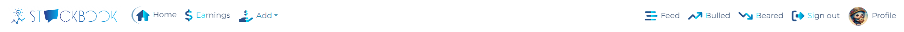
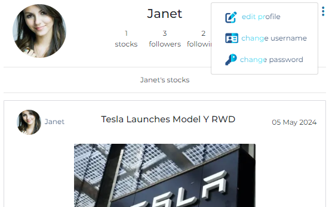

#  
Stock Book 

\
&nbsp;

## Introduction

Welcome to my repository that represents Stock Book website.
It is a stock blog website that allows users to add their stock blogs, news, order and earning events. Encourage users for more interaction to increase stock movement in the stockmarket.

 This repository contains the code for building a modern and responsive website using React for frontend and Django-rest for backend development.

Visit [Stock Book website](https://stock-book-7c5f07440d68.herokuapp.com/) website

Visit [Stock Book GitHub Repository](https://github.com/Ahmadalhindi/stockbook)

- - -

\
&nbsp;

## Table of Contents

- [Introduction](#introduction)
- [User Experience](#user-experience)
  - [Site Objectives](#site-objectives)
  - [Target Audience](#target-audience)
- [Structure](#structure)
  - [Entity-Relationship Diagram ERD](#entity-relationship-diagram-erd)
  - [Database Plan](#database-plan)
  - [User Stories](#user-stories)
- [Skeleton](#skeleton)
  - [Wireframes](#wireframes)
  - [Fonts](#fonts)
  - [Responsive Screens](#responsive-screens)
- [Features](#features)
  - [All pages](#all-pages)
  - [Homepage](#homepage)
  - [Post Detail](#post-detail)
  - [Sign Up](#sign-up)
  - [Sign Out](#sign-out)
  - [Admin Panel](#admin-panel)
- [Technologies Used](#technologies-used)
- [Testing](#testing)
  - [Manual Test](#manual-test)
  - [Responsive Screens Testing](#responsive-screens-testing)
  - [Code Validation](#code-validation)
- [Bugs](#bugs)
  - [Fixed Bugs](#fixed-bugs)
  - [Unfixed Bugs](#unfixed-bugs)
- [Deployment](#deployment)
- [Credits](#credits)

\
&nbsp;

- - -

## User Experience

### Site Objectives
- Blog platform divided into two sections:
  - Stock post: share the stock news, transactions with ability to attach image or chart.
  - Earning event: share the earning date for a stock.
- Encourage friendly interactions for financial and social goals throuth:
  - Add comments in stock posts.
  - Click counted bull as a buy or bear as a sell in stock posts.
- A Profile books that allow user to follow or unfollow other user profiles to feed on their posts and stock movements.
- The permission for functionality limited accordingly:
  - Unregistered user: Only view most of the site without interactions of above objectives.
  - Registered user: Full accessibility and interactions.
- Perform search in stock and earning pages and filter stock for a specific sector from 11 categorized GICS*.
- Nonprofit project for my education purpose .

*GICS: Global Industry Classification Standard

### Target Audience
- Users and investors that are interested in stock market.
- New investors who seeking for guidance and tips in investing.
- Investors that are sharing their experiences and transactions and news of stocks.
- Traders that are trying to gain an advantage of stock sentiment as a signal to buy or sell.

[Back to contents](<#contents>)

\
&nbsp;

## Structure

### Entity-Relationship Diagram ERD

### API Models

1.	Profile Model:
- Purpose: Represents user profiles, providing information like name, biography, and profile image.
- Attributes:
  - owner:
  One-to-one relationship with the User model representing the user who owns the profile.
  - created_at: DateTimeField indicating when the profile was created.
  - updated_at: DateTimeField indicating when the profile was last updated.
  - name: CharField representing the name of the user.
  - bio: TextField for a brief biography of the user.
  - image: ImageField for the profile image of the user.
2.	Stock Model:
- Purpose: Represents stocks owned by users, storing details such as title, symbol, company name, sector, order type, etc.
- Attributes:
  - Similar to Profile model, it has owner with ForeignKey relationship with the User model, created_at, and updated_at fields.
  - Other fields include title, symbol, company_name, sector, order, order_date, order_price, quantity, content, and image.
  - order_choices and sector_choices provide options for the order type and sector respectively.

3.	Earning Model:
- Purpose: Stores earnings data associated with stocks.
- Attributes:
  - owner: ForeignKey relationship with the User model.
  - created_at: DateTimeField indicating when the earnings data was created.
  - updated_at: DateTimeField indicating when the earnings data was last updated.
  - ticker: CharField representing the ticker symbol of the associated company.
  - earning_date: DateField indicating when the earnings were reported.
4. & 5.	Bear Model and Bull Model:
- Purpose: Represent entities associated with users and stocks, indicating pessimistic (bear) or optimistic (bull) sentiment towards a stock.
- Attributes:
  - owner: ForeignKey relationship with the User model.
  - stock: ForeignKey relationship with the Stock model.
  - created_at: DateTimeField indicating when the entity was created.
  - These models help track sentiment towards stocks among users.
6.	Comment Model:
- Purpose: Represents comments made by users on stocks.
- Attributes:
  - owner: ForeignKey relationship with the User model.
  - stock: ForeignKey relationship with the Stock model.
  - created_at: DateTimeField indicating when the comment was created.
  - updated_at: DateTimeField indicating when the comment was last updated.
  - content: TextField representing the content of the comment.
7.	Follower Model:
- Purpose: Represents the relationship between users where one user follows another.
- Attributes:
  - owner: ForeignKey relationship with the User model, representing the user who follows.
  - followed: ForeignKey relationship with the User model, representing the user being followed.
  - created_at: DateTimeField indicating when the relationship was created.

### Agile Methodology  Milestones & User Stories

The stock-book project was developed with 6 milestones and each contains their user stories that labeled according to its priority:

Link to the [stock-book project](https://github.com/users/Ahmadalhindi/projects/12).

#### Milestone: Backend stock-book

| 
#
 | 
User Story
 |  
User/Registered user/Admin
 | 
Content
 | 
Label
 |
| :------: | :------: | :------: | ------ | :------: |
| [1](https://github.com/Ahmadalhindi/stockbook/issues/9) | Admin user name and password | Admin  | I want to be able to create an admin name and password so I can have a full control of the backend. | Must have |
| [2](https://github.com/Ahmadalhindi/stockbook/issues/9) | User Profile | Admin | I want to be able to access and edit User's Profile so I can manage user authentication and permission. | Must have |
| [3](https://github.com/Ahmadalhindi/stockbook/issues/9) | Profiles app | Admin | I want to be able to have full control of profiles app on backend so I can allow user to access and manage their profiles on frontend. | Must have |
| [5](https://github.com/Ahmadalhindi/stockbook/issues/9) | Stocks app | Admin | I want to be able to have full control of stock app on backend so I can allow users for the best use and edit their stocks transactions on frontend. | Must have |
| [6](https://github.com/Ahmadalhindi/stockbook/issues/9) | Comments app | Admin | I want to be able to have full control of comments app on backend so I can allow users for the best use and edit their comments on frontend. | Must have |
| [7](https://github.com/Ahmadalhindi/stockbook/issues/9) | Bulls app | Admin | I want to be able to have full control of bull app on backend so I can allow users for the best use of bull button on frontend. | Must have |
| [8](https://github.com/Ahmadalhindi/stockbook/issues/9) | Bears app | Admin |  I want to be able to have full control of bears app on backend so I can allow users for the best use of bear button on frontend. | Must have |
| [10](https://github.com/Ahmadalhindi/stockbook/issues/9) | Followers app | Admin | I want to be able to have full control of followers app on backend so I can allow users for the best use by adding their followers on frontend. | Must have |
| [11](https://github.com/Ahmadalhindi/stockbook/issues/9) | Search and filter equipments | Admin |  I want to be able to create search and filter equipments on backend so I can allow users find particular content more easily on frontend. | Should have |

#### Milestone: Frontend - Navigation

| 
#
 | 
User Story
 |  
User/Registered user/Admin
 | 
Content
 | 
Label
 |
| :------: | :------: | :------: | ------ | :------: |
| [12](https://github.com/Ahmadalhindi/stockbook/issues/9) |  Navigation Bar | User | I want to reach the navigation bar at the top of the page so I can navigate between the pages freely. | Must have |
| [13](https://github.com/Ahmadalhindi/stockbook/issues/9) | Fixed Navigation | user | I want to see nav bar in every page so I can navigate any page without go back to the home page. | Should have |
| [14](https://github.com/Ahmadalhindi/stockbook/issues/9) | Registration and Login Status | Registered User | I want to be able to be aware of my registration and login statu in the nav bar so I can make fast action for regiseration or log out for protection. | Must have |

#### Milestone: Frontend - User Accessibility

| 
#
 | 
User Story
 |  
User/Registered user/Admin
 | 
Content
 | 
Label
 |
| :------: | :------: | :------: | ------ | :------: |
| [15](https://github.com/Ahmadalhindi/stockbook/issues/9) | Registeration  | User | I want to be able to have full control of stock app on backend so I can allow users for the best use and edit their stocks transactions on frontend. | Must have |
| [16](https://github.com/Ahmadalhindi/stockbook/issues/9) | Sign in/out | Registered User | I want to be able to sign in to my account so I can get full advantages and the best use of the site. | Must have  |
| [17](https://github.com/Ahmadalhindi/stockbook/issues/9) | Refreshing Access Tokens | Registered User | I want to be able to maintain my logged-in status until I choose to log outcapability so I can have best use and my experience is not compromised. | Must have |

#### Milestone: Frontend - Stock Posts

| 
#
 | 
User Story
 |  
User/Registered user/Admin
 | 
Content
 | 
Label
 |
| :------: | :------: | :------: | ------ | :------: |
| [18](https://github.com/Ahmadalhindi/lithium-battery-recycle-blog/issues/7) | Create a new Stock Post | Registered User | I want to be able to add a new stock post so I can publish it for others to see and interact with it. | Must have |
| [19](https://github.com/Ahmadalhindi/lithium-battery-recycle-blog/issues/8) | Add Stock Details and Transaction. | Registered User | I want to be able to add the details and the transaction of the stock so I can give more attention about the volume and my portfolio. | Must have |
| [20](https://github.com/Ahmadalhindi/lithium-battery-recycle-blog/issues/8) | Add Stock Chart and News | Registered User | I want to be able to add a chart image and news for the stock post so I can share more knwoledge about stock indicators within the chart. | Should have |
| [22](https://github.com/Ahmadalhindi/lithium-battery-recycle-blog/issues/8) | Edit/Delete Stock Post | Registered User | I want to to be able to make any changes in my stock post details so I can add more information or correct any details or delete the post. | Must have |
| [26](https://github.com/Ahmadalhindi/lithium-battery-recycle-blog/issues/8) | Search Stocks by Keywords | User | I want to to be able to search for stock posts (symbol, order, user name ..) so I can Easily find the subject that I'm interested in. | Should have |
| [44](https://github.com/Ahmadalhindi/lithium-battery-recycle-blog/issues/8) | Filter Stocks by Sector | Registered User | I want to be able to filter the stocks according to sector so I can easily view all stocks that belong to the sector that I like most. | Nice to have

#### Milestone: Frontend - Home Page

| 
#
 | 
User Story
 |  
User/Registered user/Admin
 | 
Content
 | 
Label
 |
| :------: | :------: | :------: | ------ | :------: |
| [23](https://github.com/Ahmadalhindi/lithium-battery-recycle-blog/issues/8) | Top Apearing Stock | User | I want to be able to view most recent posts so I can be up to date and select the new stock fastly. | Should have |
| [24](https://github.com/Ahmadalhindi/lithium-battery-recycle-blog/issues/7) | View All Stock Posts | User | I want to be able to view all stock posts so I can select the stock directly after entering the home page. | Must have |
| [25](https://github.com/Ahmadalhindi/lithium-battery-recycle-blog/issues/8) | Keep Scrolling |  User | I want to be able to keep scrolling throught all stock posts so I can have unstoppable scrolling without any distraction. | Nice to have |

#### Milestone: Frontend - Communication

| 
#
 | 
User Story
 |  
User/Registered user/Admin
 | 
Content
 | 
Label
 |
| :------: | :------: | :------: | ------ | :------: |
| [27](https://github.com/Ahmadalhindi/lithium-battery-recycle-blog/issues/8) | Create a Comment | Registered User | I want to be able to Create my own comments so I can share my thoughts and interact with other. | Must have |
| [28](https://github.com/Ahmadalhindi/lithium-battery-recycle-blog/issues/7) | Edit a Comment | Registered User | I want to be able to edit my comments so I can reform and make best changes to my comments. | Must have |
| [29](https://github.com/Ahmadalhindi/lithium-battery-recycle-blog/issues/8) | Delete a Comment | Registered User | I want to be able to delete my comment so I can git rid of unwanted comments. | Must have
| [30](https://github.com/Ahmadalhindi/lithium-battery-recycle-blog/issues/8) | View Comments |  User | I want to be able to view all comments in the stock post so I can see the reaction of others about every stock post. | Must have |
| [31](https://github.com/Ahmadalhindi/lithium-battery-recycle-blog/issues/7) | Click Bull for a Stock | Registered User | I want to be able to click bull button for a stock so I can represent my thought about stock price and push the stock order to buy related to a stock post. | Must have |
| [32](https://github.com/Ahmadalhindi/lithium-battery-recycle-blog/issues/8) | Click Bear in Stock Posts | Registered User | I want to be able to click bear button for a stock so I can represent my thought about stock price and push the stock order to sell for a stock post. | Must have

#### Milestone: Frontend - User Profile Page

| 
#
 | 
User Story
 |  
User/Registered user/Admin
 | 
Content
 | 
Label
 |
| :------: | :------: | :------: | ------ | :------: |
| [33](https://github.com/Ahmadalhindi/lithium-battery-recycle-blog/issues/8) | Filter Stocks by Followed Users | Registered User | I want to be able to view stocks of followed users so I can keep track with their new publishing. | Nice to have |
| [36](https://github.com/Ahmadalhindi/lithium-battery-recycle-blog/issues/8) | View Users Profiles |  User | I want to be able to view users profiles so I can know more about them and their stock. | Must have |
| [37](https://github.com/Ahmadalhindi/lithium-battery-recycle-blog/issues/7) | Follow/Unfollow Users | Registered User | I want to be able to follow or unfollow users so I can keep track with followed. | Must have |
| [38](https://github.com/Ahmadalhindi/lithium-battery-recycle-blog/issues/8) | Edit profile | Registered User | I want to be able to edit my profile so I can update my profile with new image and bio. | Must have
| [39](https://github.com/Ahmadalhindi/lithium-battery-recycle-blog/issues/8) | View User Profile Statistics | User | I want to be able to view the last user statistics (bio, number of posts, follows, users followed, bulls stocks and bears stocks) so I can know more about them and their stocks orders. | Should have |
| [40](https://github.com/Ahmadalhindi/lithium-battery-recycle-blog/issues/8) | Most followed profiles | Registered User | I want to be able to view most followed profiles so I can know which profiles are popular. | Nice to have |

#### Milestone: Frontend - Bulls and Bears

| 
#
 | 
User Story
 |  
User/Registered user/Admin
 | 
Content
 | 
Label
 |
| :------: | :------: | :------: | ------ | :------: |
| [34](https://github.com/Ahmadalhindi/lithium-battery-recycle-blog/issues/7) | View Bulls in Stock | Registered User | I want to see stocks that I clicked for bull so I can decide which stock I need to buy. | Nice to have |
| [35](https://github.com/Ahmadalhindi/lithium-battery-recycle-blog/issues/8) | View Bears in stocks | Registered User | I want to see stocks that I clicked for bear so I can decide which stock I need to sell. | Nice to have

#### Milestone: Frontend - Earning Events

| 
#
 | 
User Story
 |  
User/Registered user/Admin
 | 
Content
 | 
Label
 |
| :------: | :------: | :------: | ------ | :------: |
| [41](https://github.com/Ahmadalhindi/lithium-battery-recycle-blog/issues/8) | Create a new Earning event | Registered User |  I want to be able to add a new earning for a stock so I can publish it for others to see and interact with it. | Must have |
| [42](https://github.com/Ahmadalhindi/lithium-battery-recycle-blog/issues/8) | Edit/Delete Earning | Registered User | I want to to be able to make any changes in my earning details so I can add more information or correct any details or delete the event. | Must have |
| [43](https://github.com/Ahmadalhindi/lithium-battery-recycle-blog/issues/7) | View All Earning events | User | I want to be able to view all earning events so I can select to see the earning that I like. | Must have |
| [45](https://github.com/Ahmadalhindi/lithium-battery-recycle-blog/issues/9) | Search Earning Event by keyword | User |  I want to be able to search earning events by ticker stock or user so I can easily find the earning that I'm interested without scrolling the page. | Should have |

### User stories (Ignored status): for lack ot times

| 
#
 | 
User Story
 |  
User/Registered user/Admin
 | 
Content
 | 
Label
 |
| :------: | :------: | :------: | ------ | :------: |
| [4](https://github.com/Ahmadalhindi/lithium-battery-recycle-blog/issues/5) | Profolio app | Admin | I want to be able to have full control of profolio app on backend so I can allow users for the best use and edit profolio on frontend. | Nice to have & Ignored  |
| [9](https://github.com/Ahmadalhindi/lithium-battery-recycle-blog/issues/10) | Likes app | Admin | I want to be able to have full control of likes app on backend so I can allow users to add or remove their likes on frontend. | Nice to have & Ignored |
| [21](https://github.com/Ahmadalhindi/lithium-battery-recycle-blog/issues/7) | Auto adding Default Image Related to the Stock Order | Registered User | I want to be able to add image or leave it as default so I can give more attention about my stock order wither is it hold: bull and bear image or buy: bull image or sell: bear image. | Nice to have & Ignored |

[Back to contents](<#contents>)

\
&nbsp;

# Skeleton
## Wireframes
- Home page/Stocks page:

- Earnings page:

## Fonts
- Montserrat, sans-serif: Montserrat Weight: 100 – 900

Montserrat is a good font to use due to its modern design, readability, and wide availability.

## Responsive Screens
The website delivers a consistent and user-friendly experience across a wide range of devices, contributing to improved usability and accessibility.

### Breakpoints
- **Desktop**: 992px and above
  - Navigation bar with visibility for logo and all items and buttons
  - Grid layout adjusts to accommodate larger screen sizes.
- **Tablet**: 768px - 991px
  - Navigation bar: logo remains visible, but items and buttons may collapse to a hamburger drop down menu.
  - Blogs will be listed vertically.
- **Mobile**: Below 768px
  - Navigation bar: the Logo and the hamburger icon will vertically align.
  - Content stacks vertically for easier scrolling on smaller screens.

- - -

[Back to contents](<#contents>)

\
&nbsp;

## Testing

Click on provided link to visit the [Test](TEST.md) page.

\
&nbsp;

## Navigation Bar
Intuitive, efficient, and located on top of all pages for helping users find the information they're looking for quickly and easily.

- Logo: It is created as a brand image positioned at the left-hand side. Contains text that represents the name of the website and the letter "O" replaced by an icon to illustrate the communicate. Clicking on the logo directs users back to the homepage.

- Logged out user:
  - Homepage, Earning on the left
  - Sign in, Sign up on the right

- Logged in user:
  - Homepage, Earning, Add menu on the left
  - Feed, Bulled, Beared, Sign out, Profile on the right

Responsive - small screen:

## Sign up page:
Form for registeration with proper valdiation warnings and link to sign in for already registered users.

## Sign in page:
Form to sign in for registered users with proper valdiation warnings and link to sign up if the user not registered yet.

## Home page/all Blog page:

Visit the page by clicking on the logo or Home item.

The stocks sorted by the recent created stocks.

## Most Followed Profiles:
List Sorted by the most followed profiles and the ability to follow up or unfollow as buttons for registered users.

The list showed in the above image in the home page section.

## Stock page:
Visit the stock by clicking on the image or the comment icon.

- Profile details: username author and the profile image
- chart or stock image
- stock details: title, symbol, sector, content ...etc
- bulled/beared:
  - All users can view the sum number beside of the beared and bulled icons.
  - Logged in users only can select between pessimistic (beared) or optimistic (bulled) sentiment towards a stock - can't select both. Also they can unselect by clicking again on the icon they select before.
  - prevent the logged out users from selection with proper valdiation warning when clicked.
  - prevent the selection for the authers of the same stock with proper valdiation warning when clicked.

- Comments:
   - All users can view the comments.
   - Only logged in users can add/edit/delete their comments on a stock.

 
Only logged in users can create/edit/delete their own stocks by click on Add menu in the nav bar then select Stock post.

Only logged in users can edit/delete their own stocks by click on three points in the stock and select edit/delete.

 - On create/edit stock page can the logged in users preview their image before confirm create/edit

 

 - On create/edit stock page can throw proper valdiation warnings error for image size/height/width or when filling text.

 ## All Earning events page:
Visit the page by click on the Earning item in the nav bar.

The earnings sorted by the nearest earning date.

 ## Earning event page:
 Visit the earning by clicking on the ticker on the earning.

- Profile details: username author and the profile image.
- Ticker: the ticker symbol of the stock.
- Earning date: the earning date that declared for the stock.

Only logged in users can create/edit/delete their own stocks by click on Add menu in the nav bar then select Stock post.

On create/edit stock page can throw proper valdiation warnings error for submit the content.

## Profile Page:
All users can view profile users by click on the profile image or username in the stock or in the earning or from list of most followed profiles.

Profile auto-created when the user sign up with default profile image.

- Username
- Profile image
- Profile statistics:
  - Sum numbers of the stocks.
  - Sum number of the followers.
  - sum number of the following.
- Stocks posted by users.

The registered user can visit the edit/change username/change password pages from the three points menu on the owner profile page as image above.

The edit pages are following the validation rules with throwing proper warning errors.

## Feed, Bulled and Beared pages:

Those pages limited to the logged in users.

- Feed page: Represents the stocks of the users that are being followed.
- Bulled page: Represents the bulled stocks.
- Beared page: Represents the beared stocks.

## Search And select menu:
- In all stocks page, all users can search by keyword as it displayed under.

- In all earnings page, all users can search by keyword as it displayed under.

- In all stocks page, all users can select all sectors or a specific sector from 11 categorized GICS sectors in dropped down menu.

