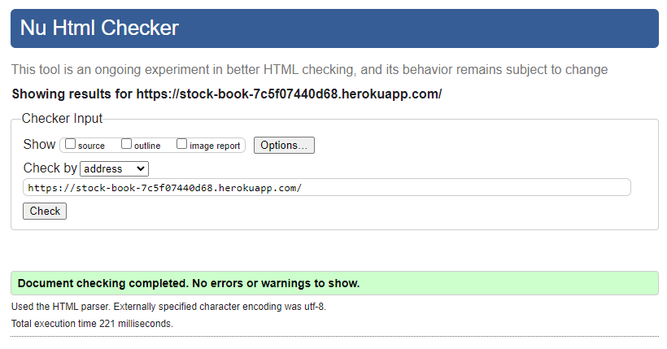
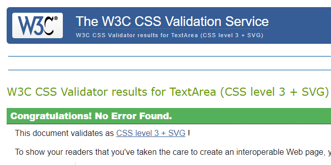
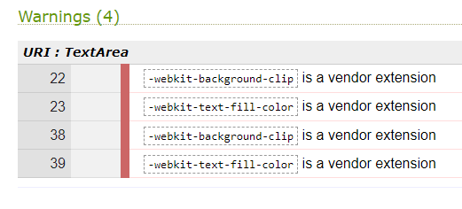
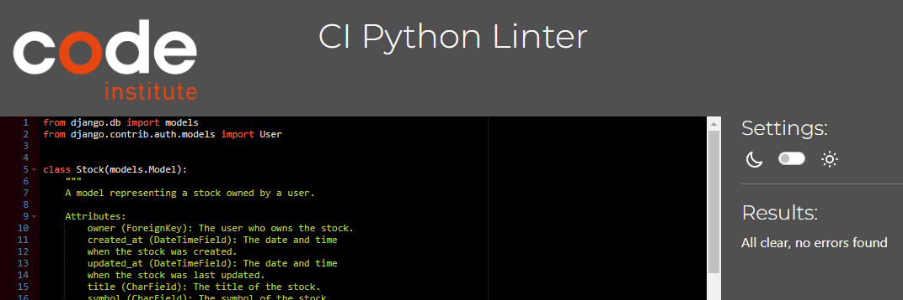
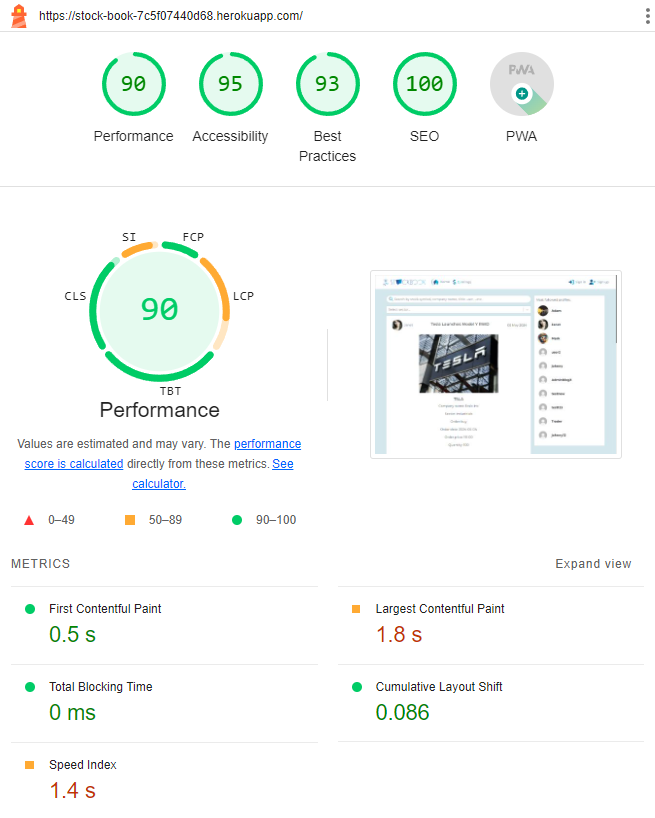

## Table of Contents

- [Manual Test](#introduction)
  - [Navigation bar](#navigation-bar)
  - [Most Followed Profiles List](#most-followed-profiles-list)
  - [Home/Stock Page](#homestock-page)
  - [Add Stock Page](#add-stock-page)
  - [Earning Page](#earning-page)
  - [Add Earning Page](#add-earning-page)
  - [Feed, Bulled, Beared Pages](#feed-bulled-beared-pages)
  - [Profile Page](#profile-page)
- [Code Validation](#code-validation)
  - [W3C Markup HTML Validator](#w3c-markup-html-validator)
  - [Jigsaw W3 CSS Validator](#jigsaw-w3-css-validator)
  - [Quick lint js](#quick-lint-js)
  - [PEP8 CI Python checker](#pep8-ci-python-checker)
- [Lighthouse](#lighthouse)

\
&nbsp;

Back to[ README](README.md)

\
&nbsp;

## Manual Test

### Navigation bar

| 
Location
 | 
Status
 | 
Objective
 | 
Process
 |  
Result
 |
| :------: | :------: | ------ | ------ | :------: |
| All pages | All users | Visit the home page: stock blogs | Click on the logo/home page on the left | Pass |
| All pages | All users | Visit the earning events page | Click on the earnings on the left | Pass |
| All pages | All users | Visit Sign in page | Click on the Sign in on the right | Pass |
| Home Page | All user | Visit Sign up page | Click on the Sign up on the right | Pass |
| All pages | Logged in users | Logged out and return to the home page | Click on the Sign out on the right | Pass |
| All pages/All screen sizes | Logged in users | Add menu | Click on 'Add' and see items to select| Pass |
| All pages | Logged in users | Visit create new stock page | Click on 'Add' dropdown menu on the left then select 'Stock post' | Pass |
| All pages | Logged in users | Visit create new tock blog page | Click on 'Add' dropdown menu on the left then select 'Earning' | Pass |
| All pages | Logged in users | Visit create new earning event page | Click on 'Add' dropdown menu on the left then select 'earning' | Pass |
| All pages | Logged in users | Visit Feed page | Click on 'Feed' on the right | Pass |
| All pages | Logged in users | View the stocks of profiles you followed | Click on 'follow' to Adam profile then visit the 'Feed' page and you will see all stock blogs that authored by Adam  | Pass |
| All pages | Logged in users | Visit Bulled page | Click on 'Bulled' on the right | Pass |
| All pages | Logged in users | View the Bulled stocks | Click on Bulled icon to the certain stock then visit the 'Bulled' page and you will see this bulled stock | Pass |
| All pages | Logged in users | Visit Beared page | Click on 'Beared' on the right | Pass |
| All pages | Logged in users | View the Beared stocks | Click on Beared icon to the certain stock then visit the 'Beared' page and you will see this beared stock | Pass |
| All pages | Logged in users | Visit Profile page | Click on 'Profile' on the right | Pass |
| All pages | All users | Auto-close the toggle menu when click out side | Click outside the toggle menu in the small screen and the menu will close | Pass
| All pages | All users | Auto-close the toggle menu when click on links except for the add menu | Click on the links in the toggle menu and the links inside the add menu in the small screen and the menu will close except for the add dropdown menu | Pass |
| All pages | All users | the add dropdown menu in the toggle menu in small screen | Open the add menu in the toggle menu and the add will dropdown a menu | Pass |

### Most Followed Profiles List:

| 
Location
 | 
Status
 | 
Objective
 | 
Process
 |  
Result
 |
| :------: | :------: | ------ | ------ | :------: |
| All pages | All user | View most followed profiles list - resposible screen | click on home/stock or earning page will see a sorted list by most followed profiles on the right on big screen and stretched above the conetnt page in the small screen   | Pass |
| All pages | Logged in users| View follow and unfollow | See 'follow' and 'unfollow' buttons beside every profiles | Pass |
| All pages | Logged in users| Create follow or destroy it to unfollow | Click on the 'follow' then cilck it again to delete it to 'unfollow' | Pass |

### Home/Stock Page:

| 
Location
 | 
Status
 | 
Objective
 | 
Process
 |  
Result
 |
| :------: | :------: | ------ | ------ | :------: |
| Home/Stock page | Pass users | View the stock blog and profile of the user | Click on the logo/home page on the left | Pass |
| Home/Stock page | All users | View the bulled, beared and comments Icons with the number of sum for each | Click on the logo/home page on the left | Pass |
| Home/Stock page | Logged in user | View the bulled and beared that created on others users blogs | Click on the 'bulled' or 'beared' icon in the other user blog and you will see the icons changed to another color | Pass |
| Home/Stock page | Unregistered/Logged out users | Prevent of create bulled or beared to the all stocks | Click on the 'bulled' or 'beared' icon then no creation happen, instead the proper warning that must log in | Pass |
| Home/Stock page | Logged in users | Prevent of create bulled or beared to the stock owner with warning | Click on the 'bulled' or 'beared' icon that you post it before then no creation happen, instead the proper warning message appear | Pass |
| Home/Stock page| Logged in users | Craete Bulled or Beared | Click on the 'Bulled' icon or 'Beared' icon and the count increases according to the select subject | Pass |
| Home/Stock page | Logged in users | Prevent of create beared and bulled together | Click on the 'bulled' icon that you beared before will unbeared the stock and Click on the 'beared' icon that you bulled before will unbulled the stock and the counting will match accordingly  | Pass |
| Home/Stock page | Logged in users | Delete Bulled | Click on the 'Bulled' icon that you select before and the count decreases | Pass |
| Home/Stock page | Logged in users | Delete Beared | Click on the 'Beared' icon that you select before and the count decreases | Pass |
| Home/Stock page | All users | Search by keyword for a stock symbol, company name, title, user or content | Click on search and write tesla or janet or ev to find the tesla post | Pass |
| Home/Stock page | All users | Select from Dropdown menu | Click on select sector filter and the menu will dropdown many sectors to select only one | Pass |
| Home/Stock page | All users | Filter for all sectors or a specific sector from 11 categorized GICS | Click on select sector filter and select industrials to fetch the tesla stock | Pass |
| Home/Stock page | All users | View loading icon when search or filter | Click on search and start writing a keyword or select a sector from the menu and the loading icon apear for a while | Pass |
| ID stock page | All users | visit the specific stock | Click on the 'image' or comment icon and this link will direct the user to the earning | Pass |
| ID Stock page | All users | View all comments | Click on the comment icon and it open the stock containing all its comments | Pass |
| ID Stock page | Logged in users | create a comment | Click on comment icon in a stock in homepage its open the stock then write a comment on the text bar then select post | Pass |
| ID Stock page | Logged in users | View the three points with menu only to the owner of the comment | Log in as mark and only see the three point on the mark comments | Pass |
| ID Stock page | Logged in users | Edit/Delete the comment | Click on the three point menu and select edit/Delete the comment | Pass |
| ID Stock page | Logged in users | View the three points with menu only to the owner of the stock | Log in as mark and only see the three point on the mark stock blog | Pass |
| ID Stock page | Logged in users | Edit/Delete the stock | Click on the three point menu and select edit/Delete the stock | Pass |
| Edit Stock Page | Logged in users | Change the image | Click on change the image button and select the image | Pass |

### Add Stock Page:
| 
Location
 | 
Status
 | 
Objective
 | 
Process
 |  
Result
 |
| :------: | :------: | ------ | ------ | :------: |
| Add Stock Page | Logged in users | Create a stock blog | Click on 'Add' dropdown menu on the left nav bar then select 'Stock post' | Pass |
| Add Stock Page | Logged in users | Preview the image | Click on 'click or tab to upload image' icon then select the image and click open | Pass |
| Add Stock Page | Logged in users | Limit size image | Add image with size more than 2 MB, refuse to create the post with validation warning under the image that 'Image size larger than 2MB!' | Pass |
| Add Stock Page | Logged in users | Limit height/width to smaller than 4096px | Add image with height/width more than 4096px, refuse to create the post with validation warning under the image: 'Image height/width larger than 4096px!' | Pass |
| Add Stock Page | Logged in users | Sector menu | Click on 'Sector' and select 'health' from the dropdown menu | Pass |
| Add Stock Page | Logged in users | Order menu | Click on 'Order' and select 'buy' from the dropdown menu | Pass |
| Add Stock Page | Logged in users | default choice | See 'hold' for 'Order' and dash line in 'Sector' as default choice | Pass |
| Add Stock Page | Logged in users | No image | Create a stock without select an image will throw validation error: 'The submitted data was not a file. Check the encoding type on the form.' | Pass |
| Add Stock Page | Logged in users | Blank field | Create a stock without fill one of the required field like 'Company name' will throw valdiation error: 'This field may not be blank.' | Pass |
| Add Earning Page | Logged in users | cancel the form and return to homepage | Visit add stock page but instead of create click on 'cancel' it returns back to the homepage | Pass |

### Earning Page:
| 
Location
 | 
Status
 | 
Objective
 | 
Process
 |  
Result
 |
| :------: | :------: | ------ | ------ | :------: |
| Earning page | All users | View the earning event associated with profile of the users | Click on the 'Earning' on the left in the nav bar | Pass |
| Earning page | All users | View the earnings sorted according to the date of earning | Create a new earning event and input the 'Earning date' as the nearest one then it apears in the first |
| Earning page | All users | Search by keyword for a ticker symbol, user name | Click on search and write nvda or adam to find the earning event | Pass |
| ID Earning page | All users | visit the specific earning | Click on the 'Ticker' and this link will direct the user to the earning | Pass |
| ID Earning page | Logged in users | Edit/Delete the earning | Click on the three point menu and select edit/Delete the earning | Pass |

### Add Earning Page:
| 
Location
 | 
Status
 | 
Objective
 | 
Process
 |  
Result
 |
| :------: | :------: | ------ | ------ | :------: |
| Add Earning Page | Logged in users | Create an earning event | Click on 'Add' dropdown menu on the left nav bar then select 'Earning' | Pass |
| Add Earning Page | Logged in users | Blank field | Create an stock without fill one of the required field like 'Company name' will throw valdiation error: 'This field may not be blank.' | Pass |
| Add Earning Page | Logged in users | cancel the form and return to homepage | Visit add earning page but instead of create click on 'cancel' it returns back to the homepage | Pass |

### Feed, Bulled, Beared Pages:
| 
Location
 | 
Status
 | 
Objective
 | 
Process
 |  
Result
 |
| :------: | :------: | ------ | ------ | :------: |
| All pages | Logged in users | View the stocks of profiles you followed | Click on 'follow' to Adam profile then visit the 'Feed' page and you will see all stock blogs that authored by Adam  | Pass |
| All pages | Logged in users | View the Bulled stocks | Click on Bulled icon to the certain stock then visit the 'Bulled' page and you will see this bulled stock | Pass |
| All pages | Logged in users | View the Beared stocks | Click on Beared icon to the certain stock then visit the 'Beared' page and you will see this beared stock | Pass |

### Profile Page:
| 
Location
 | 
Status
 | 
Objective
 | 
Process
 |  
Result
 |
| :------: | :------: | ------ | ------ | :------: |
| Profile Page | All users | View the certain profile of others | Click on profile image or username on the stock or in the most followed profiles list. These will link you to the profile user page | Pass |
| Profile Page | Logged in users | View user profile statistics and stocks | Click on 'Profile' on the right of nav bar and this will link you to the profile page | Pass |
| Profile Page | Logged in users | The counting of profile stocks | Create new stock and The counting of profile stocks will increase by one | Pass |
| Profile Page | Logged in users | The counting of followers | Click on 'Follow' to your stock from another user account and The counting of your profile followers will increase by one, and vice versa | Pass |
| Profile Page | Logged in users | The counting of following | Click on 'Follow' to a profile from the list of most followed profiles in the same page and The counting of following will increase by one, and vice versa | Pass |
| Profile Page | Logged in users | Changing username | Click on three points menu and select Changing username will link you to the username page to save your new username| Pass |
| Username Page | Logged in users | Validation of username | Keep your name unchanged or change the name to the same others name will throw proper validation error: 'A user with that username already exists' | Pass |
| Password Page | Logged in users | Changing Password | Click on three points menu and select 'Changing password' will link you to the Password page to create new one with save button | Pass |
| Password Page | Logged in users | Validation for Password | Try to write a not match the new password and the confirm password, similar username, weak, common, short passwords will throw a proper validation warning errors | Pass |
| Profile Page | Logged in users | Edit owner profile | Click on three points menu and select 'Edit' will link you to the Edit page then click save after changing | Pass |
| Profile Page | Logged in users | Edit owner profile | Click on three points menu and select 'Edit' will link you to the Edit page then click save after changing | Pass |
| Profile Page | Logged in users | Preview the profile image | Click on 'Change the image' and select one | Pass |
| Username, password and edit Pages | Logged in users | Cancel to return to Profile page | Click on 'Cancel' button to direct return to the Profile page | Pass |

\
&nbsp;

## Code Validation

### W3C Markup HTML Validator
Tested for all pages by W3c HTML Markup validation service and fixed the trailing slash. Test it again and passed with no errors.

### Jigsaw W3 CSS Validator
All CSS files tested by Jigsaw W3 CSS Validation service and passed with no errors.

But found normal 4 warnings about vendor extension, that no harm if not fix it.

### Quick lint js
Test JS and JSX/React with no errors.

### PEP8 CI Python checker
All python files tested with no errors.

\
&nbsp;

## Lighthouse

The website performed well when it came to the lighthouse test.

- - -

[Back to top](<#table-of-contents>)

\
&nbsp;

Back to[ README](README.md)